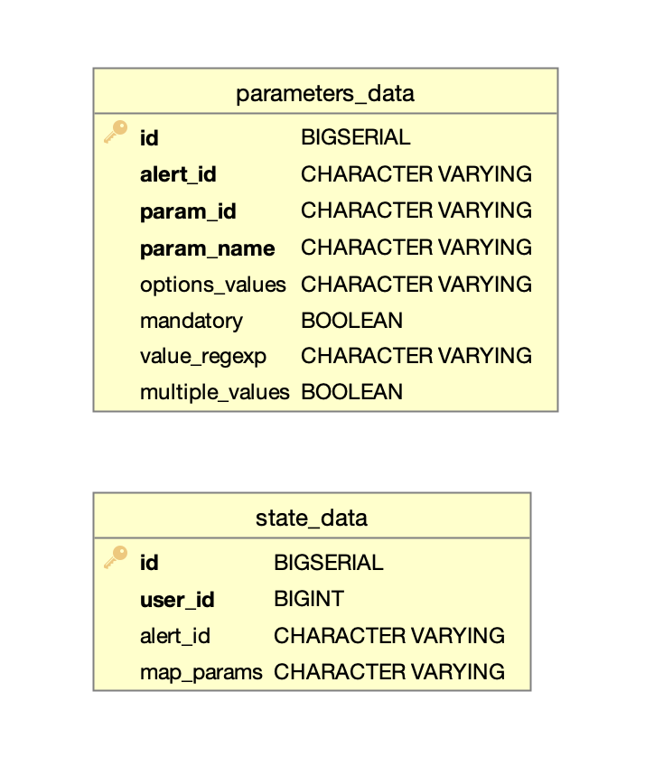

# alert-tg-bot

Телеграм бот, представляющий собой интерфейс для взаимодействия пользователя с [mayday](https://github.com/valitydev/mayday).
Позволяет добавлять пользователям необходимые алерты и получать нотификации от mayday.

## Описание работы сервиса

Бот работает взаимодействуя с [Telegram Bot Api.](https://core.telegram.org/bots/api)
Для взаимодествия с Telegram Bot Api используется [polling](https://core.telegram.org/bots/api#getupdates).
Взаимодействие с ботом разрешается только для пользователей, состоящих в общем приватном чате.

Для работы бота необходимо указать параметры:

```
bot:
token: ${botToken}
name: botName
chatId: ${chatId}
```

- Для получения _botToken_ и _botName_ необходимо использовать телеграм бота @BotFather,
там же ему необходимо ***установить инлайн-режим командой /setinline***.
- _chatId_ - приватный чат, пользователи которого смогут иметь доступ к боту. 
Бота необходимо добавить в приватный чат и ***дать ему права администратора***.
Узнать _chatId_ можно, например, отправив любое сообщение в чат и посмотрев пришедшее событие.

[При старте бота либо отправки любого сообщения в бот пользователем](src/main/java/dev/vality/alert/tg/bot/service/AlertBot.java)
в первую очередь проверяется, есть ли у пользователя доступ к боту, 
для чего проверяется является ли пользователь участником в приватном чате. 
В случае если участник не состоит в чате либо у него изменился статус (например, пользователь был удален из чата), 
доступ к боту не разрешается, ранее созданные алерты удаляются.

## Хендлеры

Каждый раз когда пользователь взаимодействует с ботом приходит событие с набором параметров,
на основе которых выбирается обработчик сообщений:

- [MessageHandler](src/main/java/dev/vality/alert/tg/bot/handler/MessageHandler.java) -
при получении команды /start либо при отправке любого сообщения в бот формирует главное меню.
При формировании главного меню к клавиатуре добавляется callbackData, 
которая возвращается в событиях боту при нажатии кнопок пользователем.


- [CallbackHandler](src/main/java/dev/vality/alert/tg/bot/handler/CallbackHandler.java) -
обрабатывает сообщения, содержащие callbackData.
В обработчике маппятся коллбэки каждой кнопки с действиями, которые необходимо выполнить
[при нажатии кнопок главного меню](src/main/java/dev/vality/alert/tg/bot/mapper/MenuCallbackMapper.java),
либо после выбора [параметра, для которого будет конфигурироваться алерт.](src/main/java/dev/vality/alert/tg/bot/mapper/ParametersCallbackMapper.java)


- [InlineHandler](src/main/java/dev/vality/alert/tg/bot/handler/InlineHandler.java) - 
обрабатывает события, которые приходят когда пользователь вводит данные для быстрого поиска из списка. Обработчик
формирует список для поиска по введенным символам и показывает список пользователю.


- [ViaBotReplyHandler](src/main/java/dev/vality/alert/tg/bot/handler/ViaBotReplyHandler.java) -
обрабатывает событие, которое происходит после того как пользователь выбрал значение из списка.


- [ForceReplyHandler](src/main/java/dev/vality/alert/tg/bot/handler/ForceReplyHandler.java) -
обрабатывает сообщение, являющееся ответом на вопрос при создании алерта, которое пользователь вводит с клавиатуры вручную.

    - **ViaBotReplyHandler** и **ForceReplyHandler** после получения значения от пользователя
[проверяют](src/main/java/dev/vality/alert/tg/bot/mapper/CreateParamsRequestMapper.java)
корректно ли введено значение пользователем и все ли значения конфигурации алерта заполнены. 
В случае если заполнены все, то формируется запрос в mayday на создание алерта, 
иначе запрашивается следующее значение для заполнения.


- [MyChatMemberHandler](src/main/java/dev/vality/alert/tg/bot/handler/MyChatMemberHandler.java) -
обрабатывает событие, которое приходит, если пользователь самостоятельно заблокировал бота. 
В таком случае все алерты, ранее созданные пользователем, удаляются.


- [MainMenuHandler](src/main/java/dev/vality/alert/tg/bot/handler/MainMenuHandler.java) -
дополнительный обработчик, который пропускает обработку сообщений в приватном чате, 
т.к. боту приходят и события из приватного чата, но на них реагировать не надо. Также формирует главное меню,
если в бот пользователь просто отправит любое сообщение, не являющееся ответом на вопросы при заведении алерта.


## [Mayday](https://github.com/valitydev/mayday)

[Обращение к mayday](src/main/java/dev/vality/alert/tg/bot/service/MayDayService.java) 
происходит в случае, когда необходимо сконфигурировать новые алерты, проверить существующие,
либо удалить существующие алерты по [протоколу](https://github.com/valitydev/mayday-proto)

Mayday также обращается к alert-tg-bot по [протоколу](https://github.com/valitydev/alert-tg-bot-proto), 
когда необходимо отправить юзеру нотификацию в случае срабатывания алерта. 
Бот [отправит нотификацию в чат с пользователем](src/main/java/dev/vality/alert/tg/bot/service/NotifierService.java). 

##Postgres



База используется для сохранения текущих параметров алерта и 
стейта пользователя, когда пользователь заполняет данные для создания алерта.
- в parameters_data сохраняется конфигурация алерта, который создает пользователь.
- в state_data сохраняется текущий стейт пользователя, маппятся параметры,
которые ввел пользователь, для дальнейшей отправки в mayday сконфигурированного алерта.
